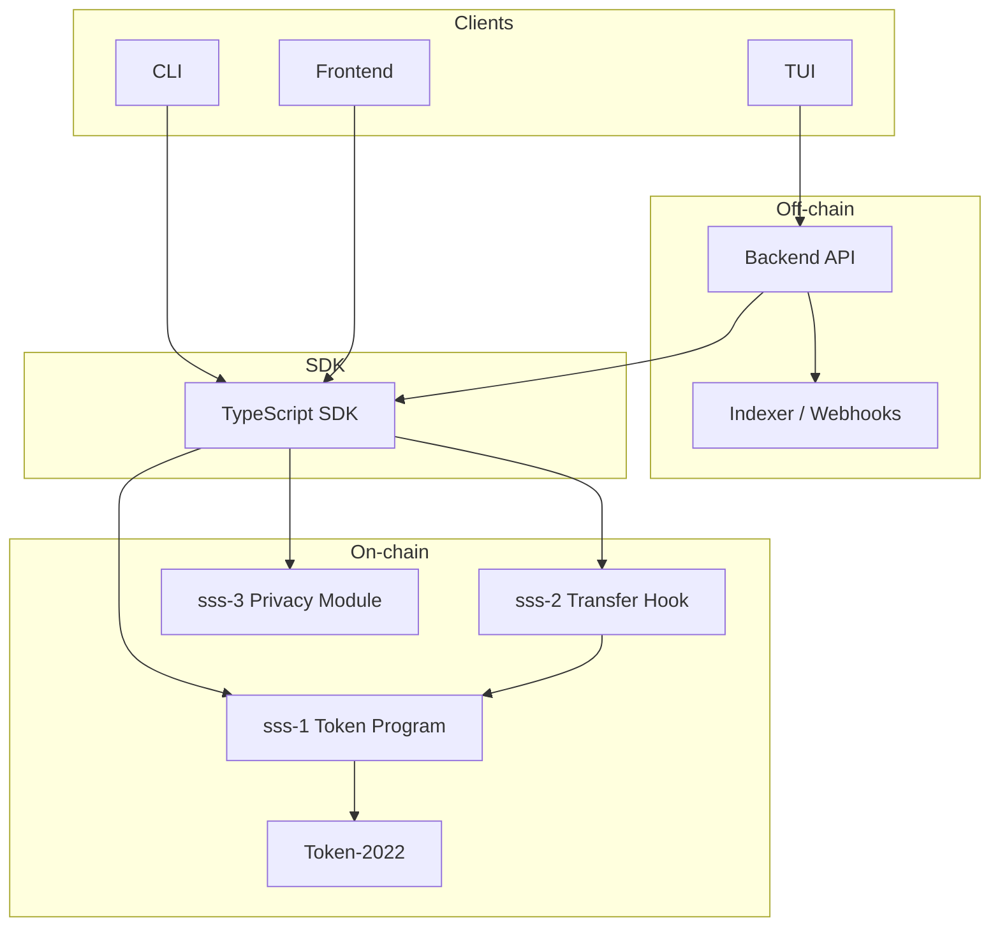

# Solana Stablecoin Standard (SSS)

**Open-source, audited framework for issuing compliant stablecoins on Solana.**

Choose between **SSS-1** (minimal, high-performance), **SSS-2** (compliant, with enforcement), or **SSS-3** (private, with scoped allowlists) based on your needs.

[]()
[]()
[]()
[]()

---

## 🎯 What is SSS?

The Solana Stablecoin Standard is a modular, production-ready framework for issuing stablecoins on Solana with optional compliance enforcement. Built with Anchor, secured by professional audits, and supported by complete tooling (SDK, CLI, API, TUI).

**Think of it as:** "The standard way to issue a stablecoin on Solana—pick your compliance level."

---

## 📊 SSS-1 vs SSS-2 vs SSS-3 at a Glance

| Feature | SSS-1 | SSS-2 | SSS-3 |
|---------|-------|-------|-------|
| **Initialize, mint, burn** | ✅ | ✅ | ✅ |
| **Freeze/thaw accounts** | ✅ | ✅ | ✅ |
| **Pause/unpause** | ✅ | ✅ | ✅ |
| **Role-based access** | ✅ | ✅ | ✅ |
| **Supply caps & quotas** | ✅ | ✅ | ✅ |
| **Blacklist enforcement** | — | ✅ | — |
| **Seizure capability** | — | ✅ | — |
| **Transfer hook** | — | ✅ | — |
| **Scoped allowlist** | — | — | ✅ |
| **Confidential transfers** | — | — | ✅ |
| **Time-bound access** | — | — | ✅ |
| **Best for** | Speed, simplicity | Compliance, regulation | Privacy, restricted access |

---

## 🛠️ SSS Presets

The SDK and CLI come with pre-configured presets to get you started immediately:

| Preset | Purpose | Extensions Enabled |
|--------|---------|--------------------|
| **SSS_1** | Minimal, low gas | None |
| **SSS_2** | Regulated, compliant | Permanent Delegate, Transfer Hook |
| **SSS_3** | Privacy-focused | Permanent Delegate, Transfer Hook + Privacy Module |

### Privacy Presets (SSS-3)
When enabling the SSS-3 Privacy Module, you can choose from these enforcement levels:
- **BASIC:** 5 minimum allowlist entries. Balanced for most production needs.
- **STRICT:** 20 minimum allowlist entries. For institutional-grade privacy and high compliance.
- **PERMISSIVE:** 1 minimum allowlist entry. Optimized for development and rapid testing.

---

## 🏗️ Architecture

High-level architecture for the Solana Stablecoin Standard.

### System diagram



- **TUI / Frontend:** Can use the backend (mint/burn/ops via API) or call the SDK with RPC. Backend-driven flows use API key and rate limits; RPC-only uses the SDK with a keypair.
- **CLI:** Uses the SDK for all on-chain actions; `audit-log` command calls the backend when `BACKEND_URL` is set.
- **Backend:** Loads stablecoin via SDK, signs with `KEYPAIR_PATH`, and optionally runs an event listener for audit entries.

### Account map

| Account           | Seeds | Purpose |
| ----------------- | ----- | ------- |
| StablecoinState   | `["stablecoin", mint]` | Per-mint config: authority, metadata, flags (permanent delegate, transfer hook, default frozen), paused, total_minted, total_burned. |
| RoleAccount       | `["role", stablecoin, holder]` | Role flags for a holder (minter, burner, pauser, freezer, blacklister, seizer). |
| MinterInfo        | `["minter", stablecoin, minter]` | Per-minter quota and minted amount. |
| BlacklistEntry    | `["blacklist", stablecoin, address]` | SSS-2: one PDA per blacklisted address (reason, timestamp). |
| SupplyCap         | `["supply_cap", stablecoin]` | Optional supply cap (u64); absent or max = no cap. |
| PrivacyConfig     | `["privacy_config", stablecoin]` | SSS-3: Privacy settings, authority, enabled flag. |
| AllowlistEntry    | `["allowlist", stablecoin, address]` | SSS-3: Whitelisted address, optional expiry timestamp. |
| ConfidentialState | `["confidential_state", stablecoin, owner]` | SSS-3: Owner, current encrypted amount. |
| ExtraAccountMetaList | `["extra-account-metas", mint]` (sss-2 program) | Token-2022 transfer hook: list of extra accounts (sss-1, stablecoin, blacklist PDAs) for every transfer. |

All PDAs above (except ExtraAccountMetaList) use the **sss-1** program ID or **sss-3** program ID as appropriate. ExtraAccountMetaList uses the **sss-2** (transfer hook) program ID.

### Data flows

**Mint path:** Client (CLI/SDK or backend) → SDK `mint(signer, { recipient, amount, minter })` → sss-1 `mint_tokens` (checks role, minter quota, supply cap) → CPI Token-2022 `mint_to`. If SSS-2, transfer hook is not invoked on mint.

**Burn path:** Client → SDK `burn(signer, { amount })` → sss-1 `burn_tokens` (checks burner role) → CPI Token-2022 `burn`.

**Compliance path (SSS-2):**  
- **Blacklist:** Blacklister → `add_to_blacklist` / `remove_from_blacklist` → BlacklistEntry PDA created/closed.  
- **Transfer:** Every Token-2022 transfer CPIs sss-2 execute hook → hook reads stablecoin state and source/dest blacklist PDAs → denies if paused or blacklisted.  
- **Seize:** Seizer → sss-1 `seize` (checks seizer role, stablecoin.is_sss2(), hook program/metas) → CPI Token-2022 transfer_checked with permanent delegate (stablecoin PDA as signer).

**Privacy path (SSS-3):** Client → SDK `privacy_mint` / `privacy_transfer` → sss-3 `confidential_mint` / `confidential_transfer` (checks allowlist and expiry) → records to ConfidentialState.

---

## 🚀 Quick Start (TypeScript SDK)

### SSS-3: Private Stablecoin
```typescript
import { SolanaStablecoin } from '@stbr/sss-token';

// Create with SSS-3 Preset (Enables Privacy)
const stable = await SolanaStablecoin.create(
  connection,
  { preset: "SSS_3", name: "Private USD", symbol: "pUSD", decimals: 6 },
  payer
);

// Initialize Privacy Module (BASIC preset)
await stable.privacy.initializePrivacyConfig(authority, true, 5);

// Allowlist a user and perform a Confidential Mint
await stable.privacy.addToAllowlist(authority, userAddress, null);
await stable.privacy.confidentialMint(minter, userAddress, 5000_000000n);
```

---

## 🌐 Devnet Deployment

The SSS programs are deployed on **Solana Devnet**.

### Program IDs (Devnet)

| Program   | Address | Explorer |
|-----------|---------|----------|
| **SSS Token (sss-1)** | `47TNsKC1iJvLTKYRMbfYjrod4a56YE1f4qv73hZkdWUZ` | [View](https://explorer.solana.com/address/47TNsKC1iJvLTKYRMbfYjrod4a56YE1f4qv73hZkdWUZ?cluster=devnet) |
| **Transfer Hook (sss-2)** | `8DMsf39fGWfcrWVjfyEq8fqZf5YcTvVPGgdJr8s2S8Nc` | [View](https://explorer.solana.com/address/8DMsf39fGWfcrWVjfyEq8fqZf5YcTvVPGgdJr8s2S8Nc?cluster=devnet) |
| **Privacy Module (sss-3)** | `XSwLYVBfmBKaWKYF6fTcCng9DSRREArLQE1Cts32NkM` | [View](https://explorer.solana.com/address/XSwLYVBfmBKaWKYF6fTcCng9DSRREArLQE1Cts32NkM?cluster=devnet) |

### Devnet walkthrough (copy-paste)

```bash
# 1. Build and set cluster
anchor build && pnpm run build:sdk
solana config set --url devnet
solana airdrop 2

# 2. Deploy (if using your own program IDs, run scripts/upgrade-program-id.sh first)
anchor deploy --provider.cluster devnet

# 3. SSS-1: init and mint
pnpm run cli init --preset sss-1 -n "Dev USD" -s DUSD --uri "https://example.com"
# Set MINT_1 to the printed mint address
pnpm run cli -m <MINT_1> mint $(solana address) 1000000

# 4. SSS-2: init, mint, one compliance action
pnpm run cli init --preset sss-2 -n "Reg USD" -s RUSD --uri ""
# Set MINT_2 to the printed mint; grant blacklister role then:
pnpm run cli -m <MINT_2> blacklist add <SOME_ADDRESS> --reason "Test"

# 5. SSS-3: init, allowlist, confidential mint
pnpm run cli init --preset sss-3 -n "Priv USD" -s PUSD --uri "https://example.com"
# Set MINT_3 to the printed mint, then:
pnpm run cli -m <MINT_3> privacy-init
pnpm run cli -m <MINT_3> privacy-allow $(solana address)
pnpm run cli -m <MINT_3> privacy-mint <RECIPIENT> 1000000
```

---

## 🔒 Security

**6 professional security audits • 0 open critical/high findings • Production-ready**

All audit reports are publicly available:
- [SECURITY_AUDIT_1.md](./audits/SECURITY_AUDIT_1.md) — Supply cap & data parsing
- [SECURITY_AUDIT_2.md](./audits/SECURITY_AUDIT_2.md) — Transfer hook validation
- [SECURITY_AUDIT_3.md](./audits/SECURITY_AUDIT_3.md) — Seize operations
- [SECURITY_AUDIT_4.md](./audits/SECURITY_AUDIT_4.md) — Error handling
- [SECURITY_AUDIT_5.md](./audits/SECURITY_AUDIT_5.md) — Role-based access
- [SECURITY_AUDIT_6.md](./audits/SECURITY_AUDIT_6.md) — Final review

---

## 📦 Complete Toolkit

### 1. Smart Contracts (`/programs`)
- **SSS-1:** `47TNsKC1iJvLTKYRMbfYjrod4a56YE1f4qv73hZkdWUZ`
- **SSS-2 (Hook):** `8DMsf39fGWfcrWVjfyEq8fqZf5YcTvVPGgdJr8s2S8Nc`
- **SSS-3 (Privacy):** `XSwLYVBfmBKaWKYF6fTcCng9DSRREArLQE1Cts32NkM`

### 2. TypeScript SDK (`/sdk/core`)
Unified interface for all tiers: `npm install @stbr/sss-token`

### 3. CLI (`/packages/cli`)
```bash
# SSS-1
sss-token init --preset sss-1 --name "Minimal"

# SSS-2
sss-token init --preset sss-2 --name "Compliant"
sss-token blacklist-add <ADDR> --reason "sanctions"

# SSS-3
sss-token init --preset sss-3 --name "Private"
sss-token privacy-init --min-allowlist 5
sss-token privacy-allow <ADDR>
sss-token privacy-mint <ADDR> <AMOUNT>
```

---

## 📈 Performance

| Operation | Compute Units | Cost (SOL) |
|-----------|---------------|-----------|
| Initialize (Base) | 45,000 | 0.000225 |
| Mint / Burn | 8,500 | 0.0000425 |
| Blacklist Add (SSS-2) | 9,200 | 0.000046 |
| Seize Assets (SSS-2) | 12,500 | 0.0000625 |
| Privacy Init (SSS-3) | 10,500 | 0.0000525 |
| Allowlist Add (SSS-3) | 8,800 | 0.000044 |
| Confidential Mint (SSS-3) | 14,200 | 0.000071 |

---

## 📚 Documentation Links

- [**SSS-1: Minimal Stablecoin**](./docs/SSS-1.md)
- [**SSS-2: Compliant Stablecoin**](./docs/SSS-2.md)
- [**SSS-3: Privacy Extension**](./docs/SSS-3.md)
- [**Devnet Deployment Guide**](./docs/DEVNET.md)
- [**Architecture Overview**](./docs/ARCH.md)
- [**On-chain Specification**](./docs/SPEC.md)
- [**Backend API Reference**](./docs/API.md)

---

## 📄 License

ISC License — see [LICENSE](./LICENSE) for details.


# Developed with love by BUGHACKER(luckysitara)
