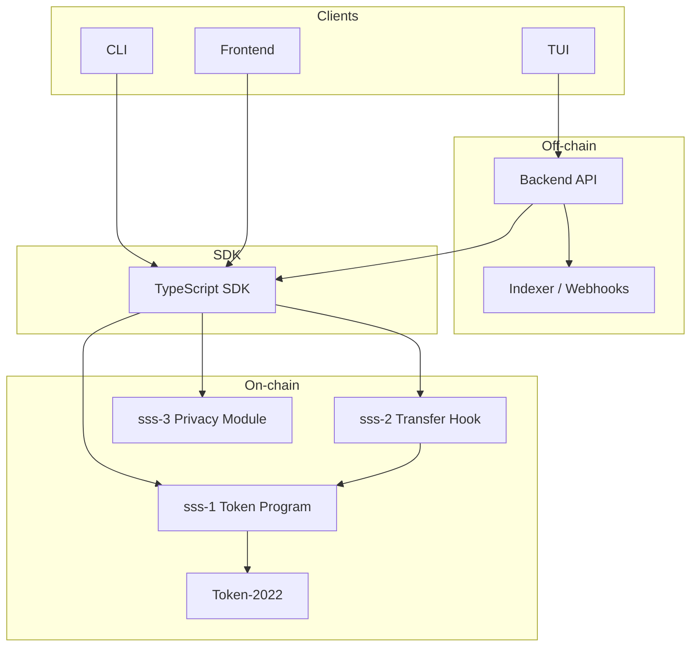

# SSS Architecture

High-level architecture for the Solana Stablecoin Standard. See [SPEC.md](SPEC.md) for on-chain specification and [API.md](API.md) for the backend API.

---

## System diagram

- **TUI / Frontend:** Can use the backend (mint/burn/ops via API) or call the SDK with RPC. Backend-driven flows use API key and rate limits; RPC-only uses the SDK with a keypair.
- **CLI:** Uses the SDK for all on-chain actions; `audit-log` command calls the backend when `BACKEND_URL` is set.
- **Backend:** Loads stablecoin via SDK, signs with `KEYPAIR_PATH`, and optionally runs an event listener for audit entries.

---

## Account map

| Account           | Seeds | Purpose |
| ----------------- | ----- | ------- |
| StablecoinState   | `["stablecoin", mint]` | Per-mint config: authority, metadata, flags (permanent delegate, transfer hook, default frozen), paused, total_minted, total_burned. |
| RoleAccount       | `["role", stablecoin, holder]` | Role flags for a holder (minter, burner, pauser, freezer, blacklister, seizer). |
| MinterInfo        | `["minter", stablecoin, minter]` | Per-minter quota and minted amount. |
| BlacklistEntry    | `["blacklist", stablecoin, address]` | SSS-2: one PDA per blacklisted address (reason, timestamp). |
| SupplyCap         | `["supply_cap", stablecoin]` | Optional supply cap (u64); absent or max = no cap. |
| PrivacyConfig     | `["privacy_config", stablecoin]` | SSS-3: Privacy settings, authority, enabled flag. |
| AllowlistEntry    | `["allowlist", stablecoin, address]` | SSS-3: Whitelisted address, optional expiry timestamp. |
| ConfidentialState | `["confidential_state", stablecoin, owner]` | SSS-3: Owner, current encrypted amount. |
| ExtraAccountMetaList | `["extra-account-metas", mint]` (sss-2 program) | Token-2022 transfer hook: list of extra accounts (sss-1, stablecoin, blacklist PDAs) for every transfer. |

All PDAs above (except ExtraAccountMetaList) use the **sss-1** program ID or **sss-3** program ID as appropriate. ExtraAccountMetaList uses the **sss-2** (transfer hook) program ID.

---

## Data flows

**Mint path:** Client (CLI/SDK or backend) → SDK `mint(signer, { recipient, amount, minter })` → sss-1 `mint_tokens` (checks role, minter quota, supply cap) → CPI Token-2022 `mint_to`. If SSS-2, transfer hook is not invoked on mint.

**Burn path:** Client → SDK `burn(signer, { amount })` → sss-1 `burn_tokens` (checks burner role) → CPI Token-2022 `burn`.

**Compliance path (SSS-2):**  
- **Blacklist:** Blacklister → `add_to_blacklist` / `remove_from_blacklist` → BlacklistEntry PDA created/closed.  
- **Transfer:** Every Token-2022 transfer CPIs sss-2 execute hook → hook reads stablecoin state and source/dest blacklist PDAs → denies if paused or blacklisted.  
- **Seize:** Seizer → sss-1 `seize` (checks seizer role, stablecoin.is_sss2(), hook program/metas) → CPI Token-2022 transfer_checked with permanent delegate (stablecoin PDA as signer).

**Privacy path (SSS-3):** Client → SDK `privacy_mint` / `privacy_transfer` → sss-3 `confidential_mint` / `confidential_transfer` (checks allowlist and expiry) → records to ConfidentialState.

---

## References

- [SPEC.md](SPEC.md) — Account types, instructions, failure modes.
- [ARCHITECTURE.md](ARCHITECTURE.md) — Layer model and feature matrix.
- [API.md](API.md) — Backend endpoints and error taxonomy.
